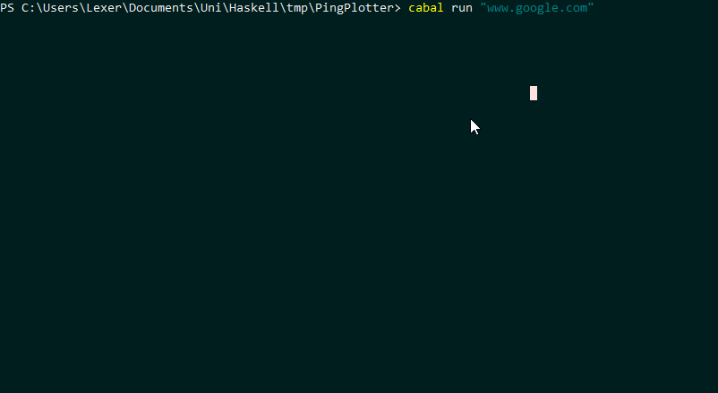
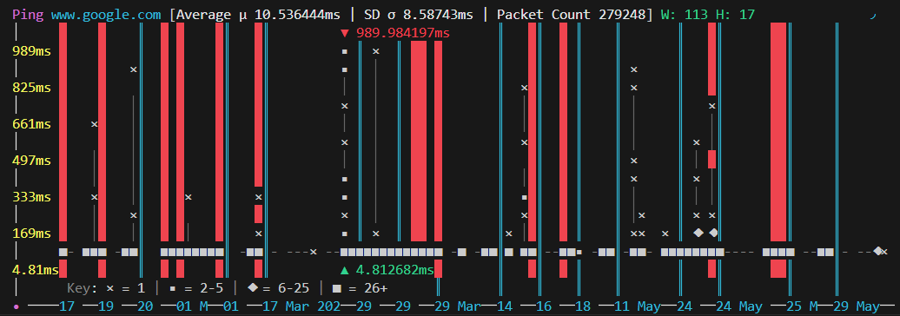
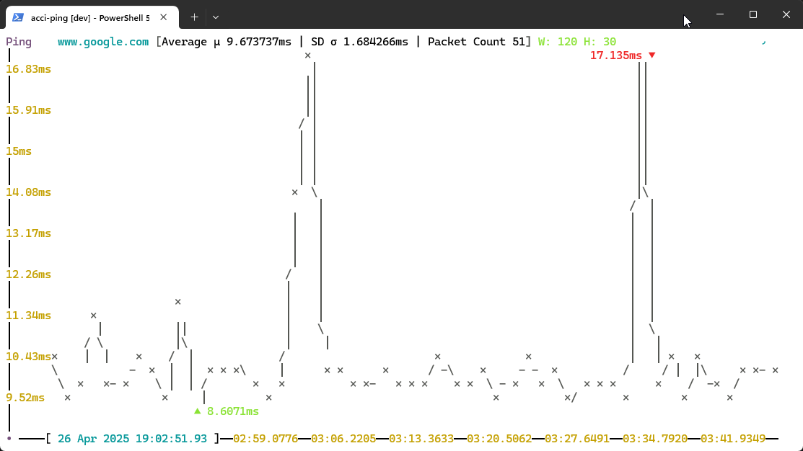

This story starts back in university. There's a few very popular student streets in which private accommodation is filled to the brim with naive students. Once upon a time I was one of these students...

At the time I frequently played [Dota 2](https://www.dota2.com/home) which if you haven't heard of already -
well done! (stay that way). For this story all you need know is it a multiplayer game over the internet.
Which brings me to Virgin Media, when I moved into this private accommodation I remember a conversation with
my new flat mates along the lines of:

<br>

> Lexer747:blockquote-blue
> Hey, which internet provider should we go with for the year?

<div></div>

> Lexer747:blockquote-cyan
> Lets go have a look at some comparison sites

<div></div>

> Lexer747:blockquote-blue
> [...]

<div></div>

> Lexer747:blockquote-cyan
> Wow Virgin sure looks like a great deal, great speeds (~70Mb/s down) and competitively priced.
>
> Compared to the others which charge more for worse speeds, it's a no-brainer!

<br>

Shortly after this conversation we get the shiny new router in the post and get it all switched on. We hit the
advertised speeds and then starts the pain.

## The ping is **terrible**...

We experienced minute to hour long "brownouts" of 500+ millisecond ping, or just abject packet loss. Somehow
the bandwidth managed to hold in spite of this, thus making it incredibly hard to communicate the exact issue to
Virgin's Customer Service. As the only complaint they're actually equipped to handle is bandwidth issues.

Over the following month or two we had 5+ "engineers" visit our property to check for what might be causing
the issue. This was until we heard on the grapevine that Virgin was well aware of the issues, but due to the short term
nature of all the contracts, and all the students in the area, they were willfully choosing to do nothing.

Basically, Virgin were circumnavigating their own processes by verifying the network infrastructure during the
summer (when all the students are not there), finding that the bandwidth and ping are vastly overspec'd, but
once the thousands of students come back, it falls over completely [^1].

This was such a deal breaker for us that we ended up just cancelling the contract, paying the exit fee, and
changing provider. Because luckily, we had BT as an actual competitor with different lines and infrastructure.
Speeds were certainly not as good but the ping was exceedingly better.

## Measuring Ping

During this period of bad internet I was searching for ways to more accurately measure how bad the problem
was, and produce actual hard data to report to our service agents. Furthermore, during
actual gaming, something on a second monitor to be able to show me in real time what was happening to the
network. Ideally with enough data I could hopefully infer what times of day should be avoided!

This initially led me to the windows CLI tool `ping`:
```
> ping www.google.com

Pinging www.google.com [3fff:fff:A0E7:7032::032A] with 32 bytes of data:
Reply from 3fff:fff:A0E7:7032::032A: time=5ms
Reply from 3fff:fff:A0E7:7032::032A: time=5ms
Reply from 3fff:fff:A0E7:7032::032A: time=6ms
Reply from 3fff:fff:A0E7:7032::032A: time=5ms

Ping statistics for 3fff:fff:A0E7:7032::032A:
    Packets: Sent = 4, Received = 4, Lost = 0 (0% loss),
Approximate round trip times in milli-seconds:
    Minimum = 5ms, Maximum = 6ms, Average = 5ms
```

Which is pretty bare-bones, but does the job for capturing some basic stats. It does leave something to be
desired in terms of second monitor app, noticing the difference between `500ms` and `5ms` is easy to do once
but parsing a monitors worth of digits is much less easy.

Furthermore, complete packet drops are also just text and can blend in too well when a monitor is filled with
text:
```
PING: transmit failed. General failure.
```

What I really wanted was a tool to plot my ping on a graph; because, as they say, a picture speaks a thousand words -
especially at a glance. I had just taken my network course at university, so ping would be a perfect toy protocol to:

* Have fun with new programming languages
* See how building TUI <sup>(Terminal User Interface)</sup> applications is done
* Use lowish level networking APIs

Thus: [PingPlotter] was born 🎉

## PingPlotter

A slightly flakey, awkward TUI built in *Haskell*:


Which, with some hindsight, wasn't the best choice in terms of an ergonomics to build out of features[^2]. The
complexity of the project rose fairly rapidly as I needed to refactor parts of the app to enable: file
saving/loading, decoupling framerate from ping-rate, and adding a log-scale toggle.

In the end I lost motivation, we switched provider by this time which eliminated my need to endlessly track
the ping as our new provider ([BT]) was providing much better latency.

This lead to a rather long hiatus between improving the tool I'd created (7 years in fact ...). Due to the
nature of Haskell, by the time I got back around to having a stab at version 2 of PingPlotter. I'd completely
lost the small details of how my program even worked and tweaking it seemed like an impossibly brittle task.
When I read my own old type signatures, an absolutely crippling level of anguish kicks in:

```hs
toInternalPure :: (RealFrac x, Enum x, Ord x, IOShow a, IOShow b) =>
    (a -> x) -> (b -> x) -> Integer -> Integer -> Graph a b -> Window Integer -> InternalGraph a b
```

And honestly I was in the mood for a re-write anyway.

> Lexer747:blockquote-cyan
> "lets see if 7 years doing software engineering would make a difference"

I thought to myself.

I did, however, want to stay true to some principals that had been acquired from the first
version, which is:

* Must run in the terminal, GUI's are banned.
* Minimal dependencies, stick to the standard library (ideally even networking is written against kernel
  level APIs).

But, at the end of it all a new tool was built - [acci-ping].

## acci-ping


A more robust, performant and shinier TUI built in *Go*. It supports many new features compared to the
original PingPlotter:

* Log-scale plotting
* Frame-rate de-coupled from ping-rate
* Statistics integrated into the display
* Colours :) - Including theming via a basic JSON schema
* The interface part of TUI, there's actually a way to interact with it while it's running
* Fully featured file saving/loading, with an export to CSV for interoperability

And even though I've now moved several times, I've never gone back to Virgin Media and my latency has never
been better. Here's a 200,000 sample spanning 6 months showing that my average ping in my current abode is
10.5ms with a standard deviation of 8.59ms. Pretty sweet.



I'm also quite happy to report that unlike PingPlotter this one comes with actual unit tests that give me
confidence to do refactors in future and add new features without breaking existing behaviour.[^3]

## Conclusion

I didn't build PingPlotter in time to save me from Virgin Media, but several years later I have built [acci-ping]
which I'd be happy to use to measure my latency long term, and hopefully have better luck escalating my poor
latency to a friendly rep who might actually be able to do something. This tool for me is a bit of insurance
that came with some fun code writing along the way. In future blog posts I plan to cover the internals of
[acci-ping], the differences between it and PingPlotter and the fun of *Go*.

Thanks for reading

~ Lexer747

<br>
<br>
<br>

### More Example Pictures



> Lexer747:blockquote-caption
> Light Mode version of [acci-ping] running on Windows 11.

<br>


> Lexer747:blockquote-caption
> Larger window size gif of acci-ping, also shows statistics at end (after pressing control-c).

-----

<br>

-----

#### Footnotes

[^1]: It should go without saying, this paragraph is all speculation on my part I don't have concrete reasons
    for why the performance was so bad and why the engineers couldn't find a solution.
[^2]: Haskell is an incredible learning tool and a fundamentally powerful and expressive language. But it just
    doesn't translate super well into procedural mechanisms and concurrency patterns, the brittleness starts
    to show very quickly. I might write more about this in future ...
[^3]: Though as you can see there's still a few bugs and growing pains at certain sizes of graphs, a slightly
    illegible y-axis is on my list to fix.


[acci-ping]: https://github.com/Lexer747/acci-ping
[BT]: https://en.wikipedia.org/wiki/BT_Group
[Dota 2]: https://www.dota2.com/home
[PingPlotter]: https://github.com/Lexer747/PingPlotter